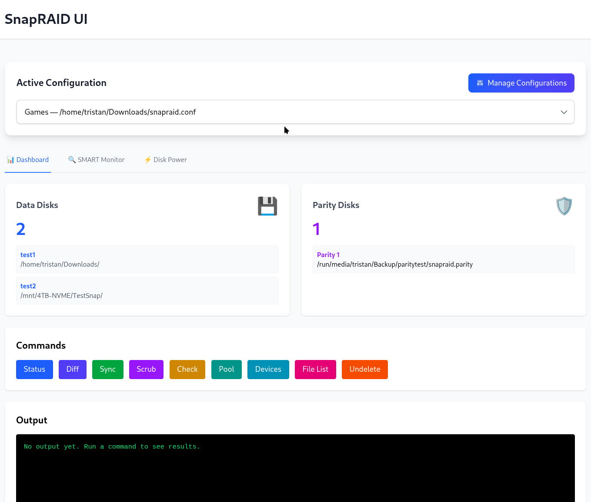
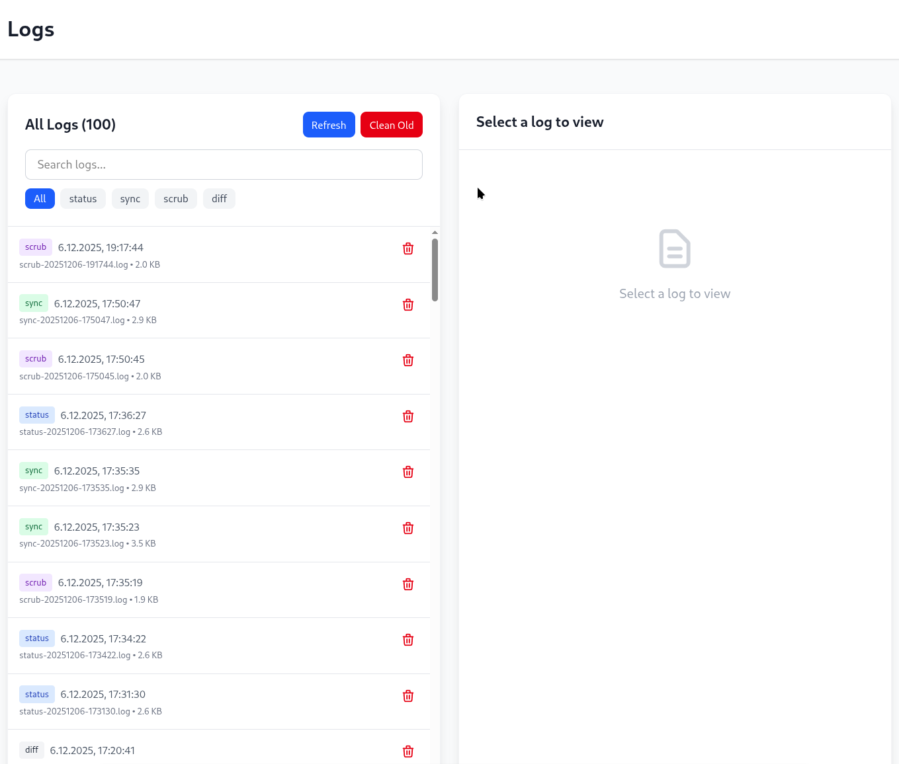
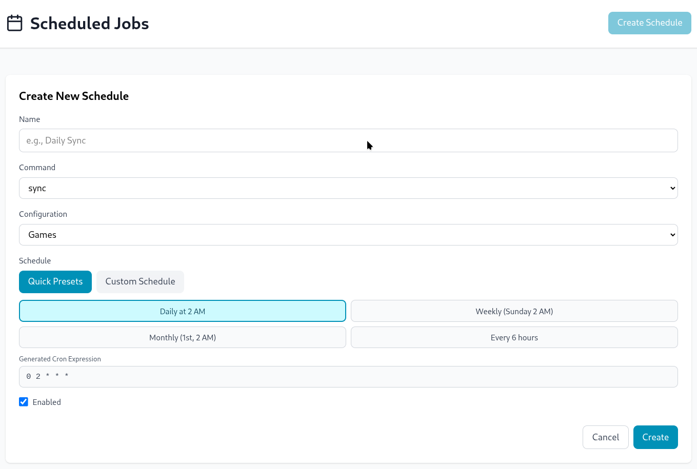

# SnapRAID Web Manager

[](https://www.docker.com/)
[](https://deno.com/)
[](https://reactjs.org/)
[](https://www.typescriptlang.org/)

A modern, user-friendly web interface for managing [SnapRAID](https://www.snapraid.it/) installations. Allows you to execute SnapRAID commands, manage configurations, monitor disks, and more – all through a web browser.

## 🚀 Overview

SnapRAID Web Manager is a complete toolkit for SnapRAID users that replaces command-line complexity with an intuitive web UI. The project consists of a Deno-based backend and a React frontend that can be deployed in a Docker container.

### Key Features

- **Configuration Management**: Easy management of multiple SnapRAID configurations
- **Disk Monitoring**: Real-time status of data and parity disks
- **Automated Tasks**: Schedulable SnapRAID operations (Sync, Scrub, Check)
- **Log Management**: Centralized logs with filter and search functions
- **Reports and Analytics**: Detailed reports on disk status and fragmentation
- **SMART Monitoring**: Monitoring of disk health
- **File Browser**: Navigate and restore files
- **Docker Integration**: Easy deployment with Docker Compose or Podman

## 📋 Prerequisites

- Docker and Docker Compose (recommended)
- SnapRAID installed on the host system
- Access to SnapRAID configuration files and disks

## 🛠️ Installation

### Local Development (Recommended for Development)

1. **Clone the repository:**
   ```bash
   git clone https://github.com/firsttris/snapraid-ui
   cd snapraid-ui
   ```

2. **Install dependencies:**
   ```bash
   ./install.sh
   ```

3. **Start the application:**
   ```bash
   ./start.sh
   ```

   This will start both the backend (Deno) and frontend (React/Vite) servers in the background.

4. **Access the application:**
   - Frontend: http://localhost:5173 (default Vite port)
   - Backend API: http://localhost:8080

### With Docker (For Production Deployment)

1. **Clone the repository:**
   ```bash
   git clone https://github.com/firsttris/snapraid-ui
   cd snapraid-ui
   ```

2. **Adjust configuration:**
   Edit `docker/docker-compose.yml` to adjust the paths to your SnapRAID configurations and disks.

3. **Start the container:**
   ```bash
   docker-compose -f docker/docker-compose.yml up --build -d
   ```

4. **Access the application:**
   - Frontend: http://localhost:3000
   - Backend API: http://localhost:8080

## 📖 Usage

After installation:

1. Open http://localhost:3000 in your browser
2. Add your SnapRAID configurations
3. Monitor your disks and perform maintenance tasks
4. Schedule automatic sync and scrub operations

### Getting Started

- **Add Configuration**: Use the Config Manager to import your `snapraid.conf` files
- **Scan Disks**: Perform an initial status check
- **Set Up Schedules**: Automate regular SnapRAID operations

## 🏗️ Architecture

- **Backend**: Deno with Hono framework, WebSocket support
- **Frontend**: React with TanStack Router, Tailwind CSS for styling
- **Database**: File-based (no external DB required)
- **Containerization**: Docker with Nginx as reverse proxy

## 📸 Screenshots

### Dashboard


### Logs


### Scheduler



## 🤝 Contributing

Contributions are welcome! Please:

1. Fork the repository
2. Create a feature branch (`git checkout -b feature/AmazingFeature`)
3. Commit your changes (`git commit -m 'Add some AmazingFeature'`)
4. Push to the branch (`git push origin feature/AmazingFeature`)
5. Open a Pull Request

### Development Guidelines

- Use TypeScript for all new code
- Run tests before committing
- Adhere to existing code styles (Biome for linting)

## 📄 License

This project is licensed under the MIT License - see the [LICENSE](LICENSE) file for details.

## 🙏 Acknowledgments

- [SnapRAID](https://www.snapraid.it/) for the underlying tool
- [Deno](https://deno.com/) for the runtime
- [React](https://reactjs.org/) and [TanStack](https://tanstack.com/) for the UI frameworks

## 📞 Support

For questions or issues:
- Open an issue on GitHub
- Check the logs in the Docker container
- Ensure SnapRAID is correctly installed

---

**Note**: This tool is not officially affiliated with SnapRAID and is developed by the community.</content>
<parameter name="filePath">/home/tristan/Projects/snapraid/README.md