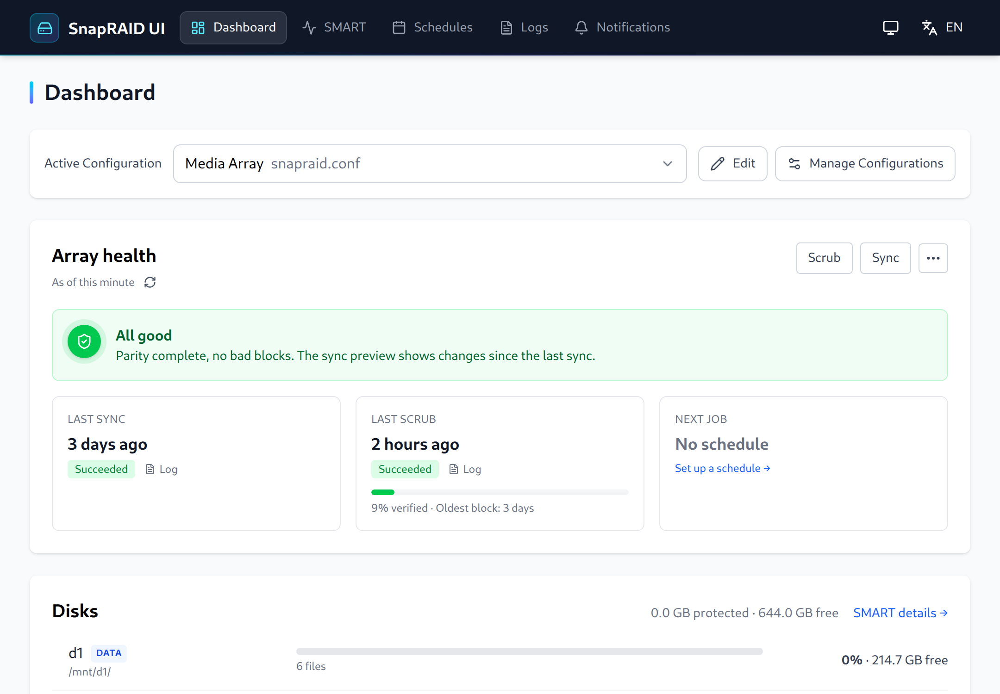
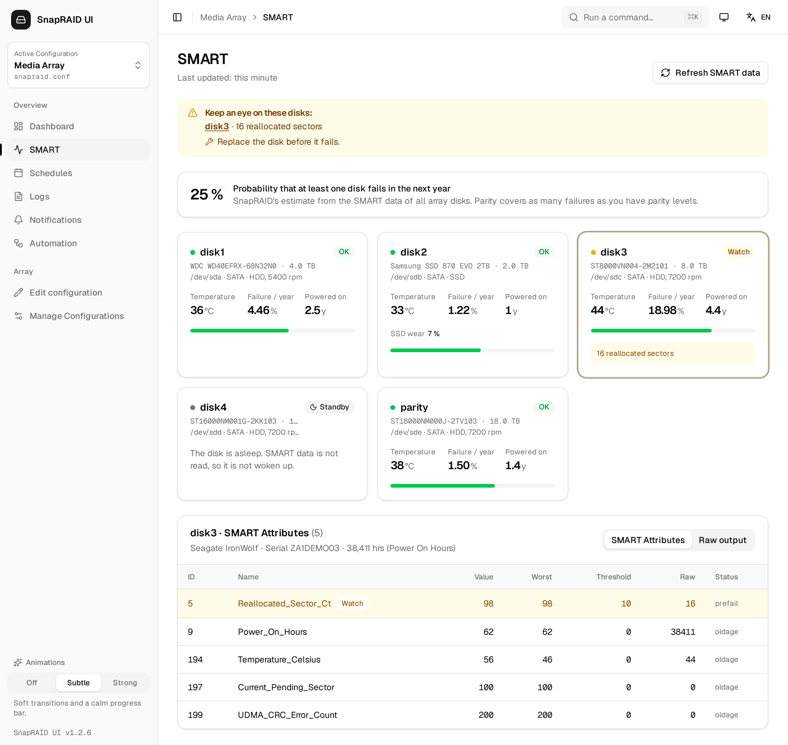
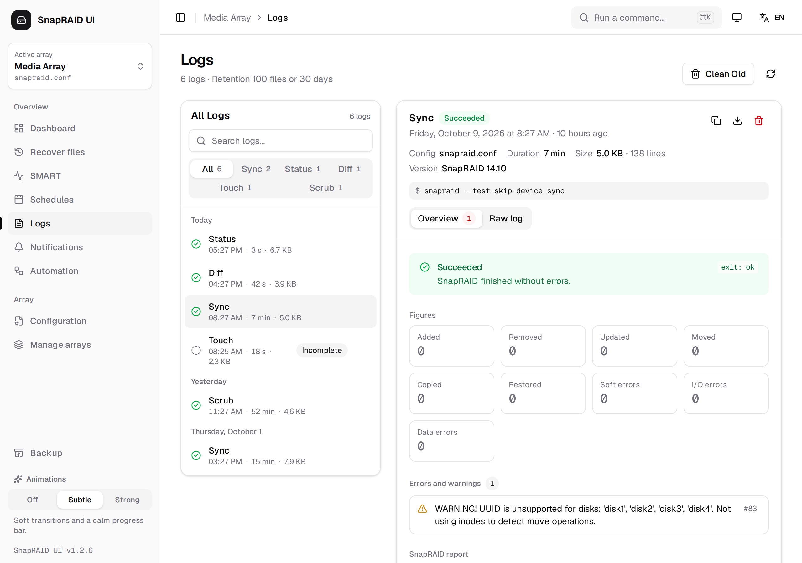
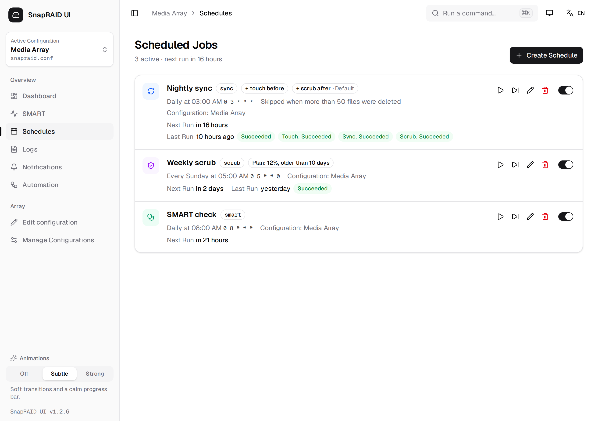
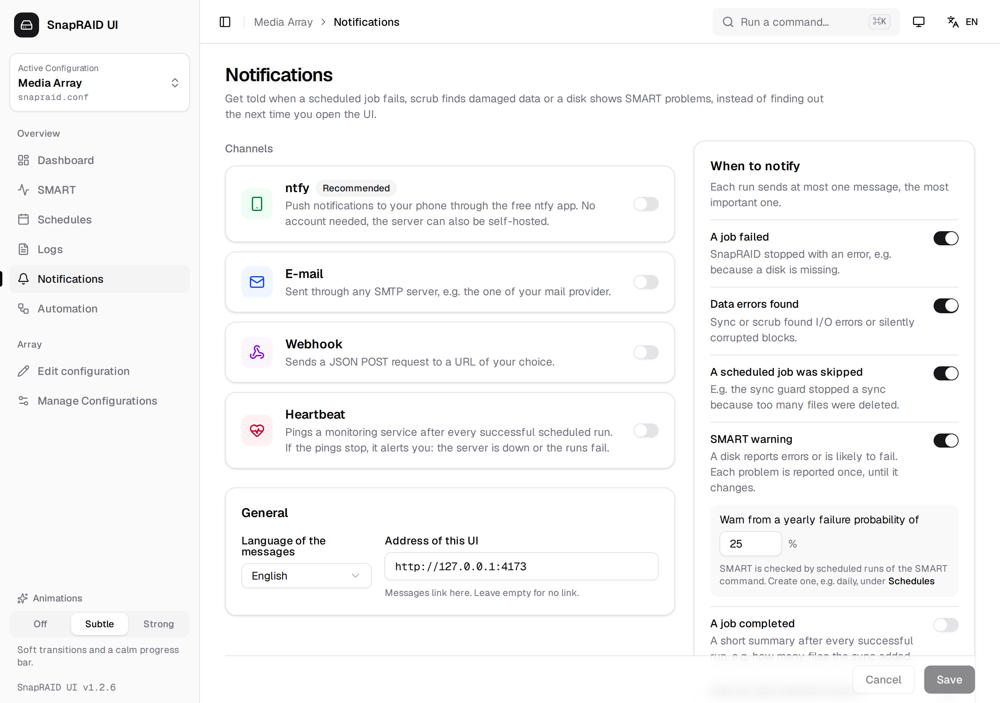
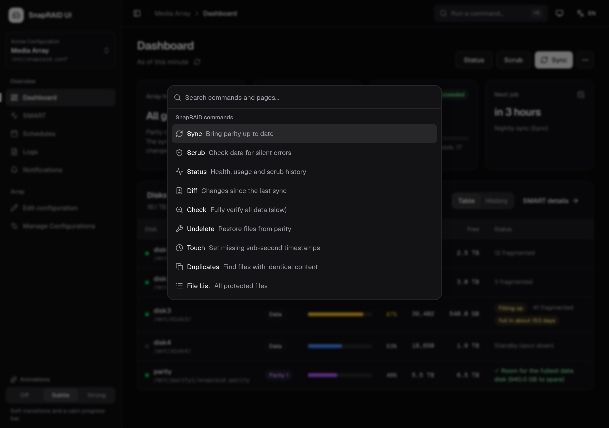
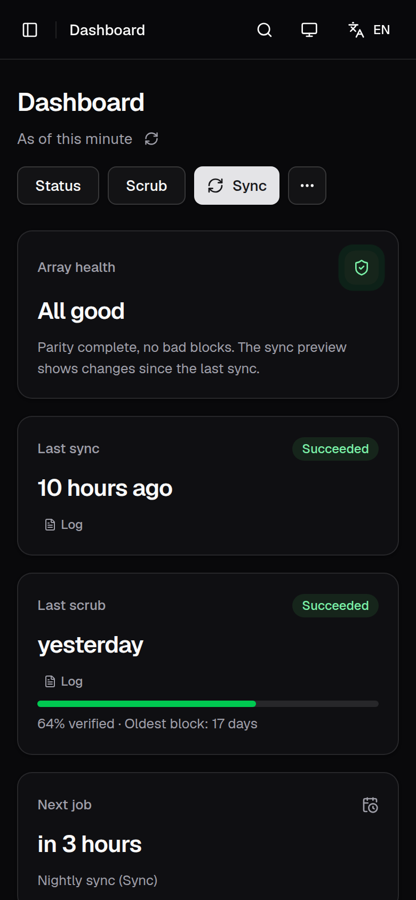

<div align="center">

# SnapRAID UI

**A modern, self-hosted web interface for [SnapRAID](https://www.snapraid.it/).**<br>
Sync, scrub, schedule and watch your disks and their SMART health from any browser, without touching the command line.<br>
One Docker image for your home server or NAS, with SnapRAID 14 included.

[](https://github.com/firsttris/snapraid-ui/actions/workflows/ci.yml)
[](https://hub.docker.com/r/tristanteu/snapraid-ui)
[](https://hub.docker.com/r/tristanteu/snapraid-ui)
[](https://hub.docker.com/r/tristanteu/snapraid-ui/tags)
[](https://www.snapraid.it/)
[](https://firsttris.github.io/snapraid-ui/)

[Features](#-features) •
[Screenshots](#-screenshots) •
[Quick start](#-quick-start) •
[Documentation](https://firsttris.github.io/snapraid-ui/) •
[Development](#️-development)

<picture>
  <source media="(prefers-color-scheme: dark)" srcset="docs/screenshot-dark.png">
  
</picture>

</div>

## 💡 Why?

SnapRAID is a great way to protect a home server's disks, but day to day it means cron jobs, log files and
remembering the right flags. SnapRAID UI puts all of it in one place:

- **See the state of your array at a glance** instead of reading `snapraid status` output.
- **Run and schedule jobs with a click**, with live output and a log of every run.
- **Hear about problems right away** through push, e-mail or webhook, before a second disk fails.
- **Get guided through the hard parts**, like replacing a failed disk or a run SnapRAID stopped for safety.

## ✨ Features

<table>
<tr>
<td width="50%" valign="top">

### 📊 Array overview
- Health, last sync and scrub, scrub coverage, next job
- Usage, files and parity headroom per disk
- Usage history and a forecast of when each disk is full

</td>
<td width="50%" valign="top">

### ⚡ Commands
- Sync with preview, scrub plans, check, fix
- Integrity page: what needs attention, scrub coverage and how old the checked blocks are
- Changes since the last sync at a glance: new files with folder sizes, deleted, changed and moved ones
- Repair and verify bad blocks with one click
- Restore deleted and changed files from parity to their state of the last sync, picked from a list, with the owner and permissions of their folder
- "Is my file protected?": search the protected files and see which disk they are on, sizes per folder
- Duplicates: choose the copy that stays, the others are deleted safely
- Live output while a job runs
- Clear explanations when SnapRAID stops a run for safety

</td>
</tr>
<tr>
<td width="50%" valign="top">

### 🗓️ Automation
- Cron schedules without editing a crontab
- Nightly routine: touch, sync, then scrub
- Sync guard that skips a scheduled sync when too many files were deleted or changed since the last sync
- Skip the next run of a schedule, or run it right now
- Pauses Docker containers during sync and scrub
- Spins idle disks down, or by hand

</td>
<td width="50%" valign="top">

### 🔔 Monitoring
- SMART health, temperature and failure probability, attributes explained in plain words
- SMART self-tests (short and long) started and followed in the browser
- Notices a disk that is not mounted before a sync drops its files
- Notifications via ntfy, e-mail or webhook, and a heartbeat for healthchecks.io or Uptime Kuma
- Prometheus metrics for Grafana and alerts
- Home Assistant: each array as a device with sensors and sync/scrub buttons (MQTT discovery)
- Searchable logs of every run

</td>
</tr>
<tr>
<td width="50%" valign="top">

### 🧰 Disk management
- Setup wizard: pick your disks, it writes `snapraid.conf` and runs the first sync
- Visual and text editor for `snapraid.conf`
- Wizards to replace or remove a disk
- Backup and restore of all settings

</td>
<td width="50%" valign="top">

### 🎨 Made for everyday use
- Light and dark theme, works on the phone
- Command palette (<kbd>Ctrl</kbd>/<kbd>⌘</kbd>+<kbd>K</kbd>)
- English, German and Italian, optional login

</td>
</tr>
</table>

## 📸 Screenshots

<table>
  <tr>
    <td width="50%"><br><sub><b>SMART</b>: health, temperature and failure probability per disk</sub></td>
    <td width="50%"><br><sub><b>Logs</b>: every run with result, figures and raw output</sub></td>
  </tr>
  <tr>
    <td width="50%"><br><sub><b>Schedules</b>: nightly sync with touch and scrub, weekly scrub, SMART check</sub></td>
    <td width="50%"><br><sub><b>Notifications</b>: ntfy, e-mail or webhook</sub></td>
  </tr>
  <tr>
    <td width="50%"><br><sub><b>Command palette</b>: run commands and jump to pages</sub></td>
    <td width="50%" align="center"><br><sub><b>On the phone</b></sub></td>
  </tr>
</table>

## 🚀 Quick start

The Docker image ships with SnapRAID 14, so nothing needs to be installed on the host.

```bash
docker run -d --name snapraid-ui \
  --privileged \
  -p 3000:80 \
  -e TZ=Europe/Berlin \
  -e SNAPRAID_UI_USERNAME=admin \
  -e SNAPRAID_UI_PASSWORD=change-me \
  -v ./snapraid:/app/snapraid \
  -v /mnt/disk1:/mnt/disk1 \
  -v /mnt/disk2:/mnt/disk2 \
  -v /mnt/parity:/mnt/parity \
  tristanteu/snapraid-ui:latest
```

Put your `snapraid.conf` into `./snapraid/` (or add one or set up a new array under *Manage arrays*) and open
**http://localhost:3000**.

- Mount your disks **at the same paths as on the host**, so the paths in `snapraid.conf` stay valid.
- `--privileged` is only needed for SMART data and the disk power state.
- `TZ` sets the time zone your schedules run in (UTC otherwise).
- Prefer Compose or Podman? See [Installation](https://firsttris.github.io/snapraid-ui/installation.html).

> [!IMPORTANT]
> Use the bundled SnapRAID rather than your distribution's. The UI reads SnapRAID's structured log, which
> exists only since version 14.0, and most distributions still ship 12.x. If cron jobs on the host run
> SnapRAID for the same array, move them to the UI's scheduler.

## 📖 Documentation

The full documentation, with search, is at **[firsttris.github.io/snapraid-ui](https://firsttris.github.io/snapraid-ui/)**.
Its source lives in [docs/](docs/).

| | |
|---|---|
| [Installation](https://firsttris.github.io/snapraid-ui/installation.html) | Docker, Compose and Podman, disks and paths, reverse proxy, updates |
| [Configuration](https://firsttris.github.io/snapraid-ui/configuration.html) | Environment variables, data directory, log retention |
| [Using SnapRAID UI](https://firsttris.github.io/snapraid-ui/usage.html) | Dashboard, commands, reports, safety stops, command palette |
| [Scheduling](https://firsttris.github.io/snapraid-ui/scheduling.html) · [Notifications](https://firsttris.github.io/snapraid-ui/notifications.html) | Automate jobs and get told when something goes wrong |
| [SMART & disk health](https://firsttris.github.io/snapraid-ui/smart.html) · [Logs](https://firsttris.github.io/snapraid-ui/logs.html) | What the UI watches and how to read it |
| [Managing disks](https://firsttris.github.io/snapraid-ui/disks.html) | Config editor, adding, replacing and removing disks, backup |
| [Security](https://firsttris.github.io/snapraid-ui/security.html) · [Troubleshooting](https://firsttris.github.io/snapraid-ui/troubleshooting.html) | Login and exposure, common problems |
| [Architecture](https://firsttris.github.io/snapraid-ui/architecture.html) · [Development](https://firsttris.github.io/snapraid-ui/development.html) | How it works, API, contributing |

## ❓ FAQ

**I already use SnapRAID. Can I keep my setup?**
Yes. Copy your `snapraid.conf` into the data directory and SnapRAID UI picks it up. Parity
and content files stay as they are, and you can go back to the command line anytime.
Turn off cron jobs or scripts like snapraid-runner, so only one scheduler runs SnapRAID.

**Do I need Docker?**
Yes, or Podman. The image (amd64 and arm64) ships SnapRAID 14, which SnapRAID UI needs
for its structured log. Most distributions still have 12.x.

**Does it wake my disks?**
Only when SnapRAID needs them. Status, protected files and duplicates come from the
content file.

**Can I open it to the internet?**
Turn on the login and put it behind a reverse proxy with HTTPS, see
[Security](https://firsttris.github.io/snapraid-ui/security.html).

**SnapRAID UI or snapraid-daemon?**
[snapraid-daemon](https://github.com/amadvance/snapraid-daemon) is Andrea Mazzoleni's lean
background service with a REST API, a scheduler and a web interface. SnapRAID UI is the
full app around SnapRAID (see [Features](#-features)). You don't have to choose: SnapRAID UI
can hand its jobs to the daemon.

**Is this an official SnapRAID project?**
No, it's independent and runs the unchanged `snapraid` binary.

**How did this start?**
As a web UI for SnapRAID. In December 2025 we proposed machine-readable output for it
([amadvance/snapraid#28](https://github.com/amadvance/snapraid/pull/28)); Andrea suggested
log tags instead and merged ours on December 10
([#29](https://github.com/amadvance/snapraid/pull/29)). snapraid-daemon followed on
December 23.

## 🛠️ Development

Requires Node.js 22+, Deno 2.5+ and the fish shell for `start.sh`.

```bash
git clone https://github.com/firsttris/snapraid-ui && cd snapraid-ui
./install.sh
./start.sh --demo   # sandbox with fake disks, no real array needed
```

The frontend runs on http://localhost:3000, the API on http://localhost:8080. Built with Deno + Hono,
React 19, TanStack Start, Tailwind CSS and shadcn/ui. See [Development](https://firsttris.github.io/snapraid-ui/development.html) for the
project layout, tests and translations.

## 🤝 Contributing

Issues and pull requests are welcome. Please run `npx biome check`, `npm run typecheck` and the tests
(`deno test --allow-all` in `backend/`, `npm test` in `frontend/`) before opening a pull request.
Changes to jobs, schedules or the Docker image are also covered by the end-to-end tests in `e2e/`,
which CI runs against the local build and the image; see [Development](https://firsttris.github.io/snapraid-ui/development.html#end-to-end-tests) to run them locally.

---

<div align="center">

⭐ Like SnapRAID UI? A [star on GitHub](https://github.com/firsttris/snapraid-ui) helps others find it.<br>
🐛 [Report a bug](https://github.com/firsttris/snapraid-ui/issues/new) · 💡 [Request a feature](https://github.com/firsttris/snapraid-ui/issues/new)

<sub>License: <a href="LICENSE">AGPL-3.0</a> · © Tristan Teufel and contributors<br>
Changed versions you pass on or run for others must offer their source code under the AGPL; a commercial license without these obligations is available via <a href="https://teufel-it.de">teufel-it.de</a>.<br>
Not affiliated with the SnapRAID project. SnapRAID is developed by Andrea Mazzoleni.</sub>

</div>
