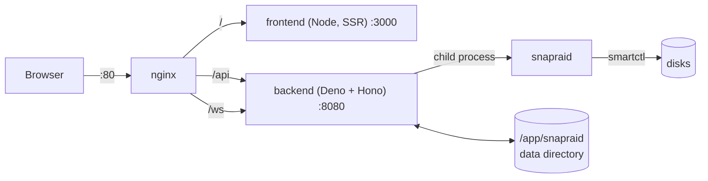
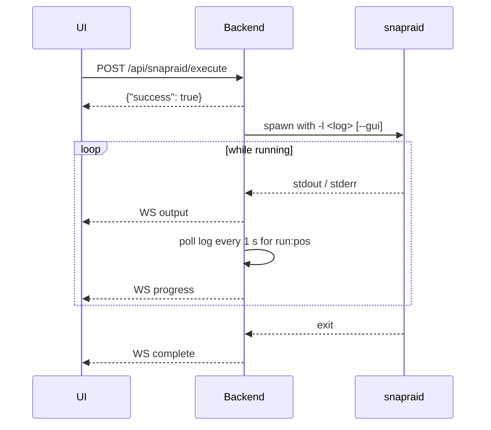

# Architecture

This page explains how SnapRAID UI is put together: the processes in the container, the backend modules, how SnapRAID is run and its output parsed, where state is stored, and how translations flow. It ends with a reference of the REST API and the WebSocket messages.

It is written for contributors and for anyone who wants to script against the backend. For setting up a development environment, see [Development](development.md).

- [Overview](#overview)
- [Container layout](#container-layout)
- [Backend](#backend)
- [Running SnapRAID](#running-snapraid)
- [Structured log parsing](#structured-log-parsing)
- [Job runner and live output](#job-runner-and-live-output)
- [Scheduler](#scheduler)
- [Storage](#storage)
- [Frontend](#frontend)
- [Internationalization](#internationalization)
- [API reference](#api-reference)
- [WebSocket](#websocket)

## Overview

SnapRAID UI has three parts:

| Part | Technology | Location |
|---|---|---|
| Backend | [Deno](https://deno.com/) + [Hono](https://hono.dev/), REST API and WebSocket on port 8080 | `backend/src/` |
| Frontend | React 19, TanStack Start / Router / Query, Tailwind CSS, shadcn/ui, Paraglide JS; server-rendered by Nitro on Node.js | `frontend/src/` |
| Shared code | Types and logic used by both sides (types, i18n markers, SMART assessment, fill-up forecast, `--force-*` detection) | `shared/` |

There is no database. All state lives in JSON files and log files in the data directory (`SNAPRAID_BASE_PATH`), next to your `snapraid.conf` files. The backend runs the `snapraid` binary as a child process and reads its **structured log** (available since SnapRAID 14.0) instead of scraping the human-readable console output.

## Container layout

The Docker image (`docker/Dockerfile`) is a multi-stage build:

1. **snapraid-builder** (Debian bookworm-slim) downloads the pinned SnapRAID release (`ARG SNAPRAID_VERSION=14.10`) and compiles it.
2. **backend-builder** (`denoland/deno:2.5.6`) installs the backend dependencies and warms the Deno module cache.
3. **frontend-builder** (`node:22-bookworm-slim`) runs `npm ci` and `npm run build`, which produces `frontend/.output/`.
4. The **final image** is based on `denoland/deno:2.5.6`, adds `nginx`, `supervisor`, `curl` and `smartmontools` (SnapRAID calls `smartctl` for `smart` and `probe`), and copies in the SnapRAID binary, the Node.js binary, the backend with its module cache and the built frontend.

Inside the container, [Supervisor](http://supervisord.org/) (`docker/supervisord.conf`) runs three programs, and `docker/entrypoint.sh` simply starts `supervisord`:

| Program | Command | Listens on |
|---|---|---|
| `nginx` | `nginx -g "daemon off;"` | 80 |
| `frontend` | `node .output/server/index.mjs` | 3000 |
| `backend` | `deno run --allow-net --allow-read --allow-write --allow-run --allow-env --allow-sys=networkInterfaces,hostname src/main.ts` | 8080 |



Nginx (`docker/nginx.conf`) routes `/` to the frontend, `/api` and `/ws` to the backend, passes WebSocket upgrades through, and sets `X-Real-IP`, `X-Forwarded-For` and `X-Forwarded-Proto`. The backend uses `X-Real-IP` to tell clients apart for the login lockout and `X-Forwarded-Proto` to decide whether the session cookie gets the `Secure` flag (see [Security](security.md)).

The image sets `SNAPRAID_BASE_PATH=/app/snapraid` and `SNAPRAID_BIN=/usr/local/bin/snapraid`, declares `/app/snapraid` as a volume, and has a health check that requests `http://localhost/` through nginx. See [Installation](installation.md) and [Configuration](configuration.md) for how to run it.

## Backend

`backend/src/main.ts` builds the Hono app, wires the modules together and starts `Deno.serve` on `0.0.0.0:8080`. On start it loads `config.json` (creating a default one if it is missing), creates the log directory, loads the schedules and runs one log rotation.

Middleware, in order:

1. **CORS**: credentials are only accepted from an origin with the same hostname as the request, e.g. the dev frontend on `localhost:3000` calling `localhost:8080`.
2. **Auth** (only when `SNAPRAID_UI_USERNAME` and `SNAPRAID_UI_PASSWORD` are both set): guards `/api/*` and `/ws`, except `/api/auth/*` and `/api/metrics`, which checks its own token. A missing or invalid session returns `401 {"error":"Unauthorized"}`. Sessions are HS256-signed JWTs in an HTTP-only `snapraid_session` cookie, see [Security](security.md).

Module map:

| Module | Responsibility |
|---|---|
| `main.ts` | App setup, middleware, route mounting, dependency injection, startup |
| `config.ts` | `SNAPRAID_BASE_PATH`, `SNAPRAID_BIN`, `SNAPRAID_EXTRA_ARGS`; `resolveFromBase()` (relative paths resolve against the data directory, absolute ones stay as they are); `snapraidCommand()` |
| `config-parser.ts` | Parses `snapraid.conf` (parity levels incl. split parity, content, data, exclude, pool, `autosave`, `blocksize`); loads and saves `config.json` |
| `auth.ts` | Login, logout, session cookie, lockout, session secret |
| `websocket.ts` | WebSocket client set, `broadcast()`, replay of the running job on connect |
| `executors/command-executor.ts` | Spawns long-running SnapRAID jobs, streams output, tracks the current and last job, follows progress, handles abort |
| `executors/log-tail.ts` | Reads new lines that a running process appends to its log file |
| `engine/engine.ts`, `engine/cli-engine.ts` | The [SnapRAID engine](#snapraid-engine) interface and its CLI implementation: jobs, status, diff, SMART, power state |
| `snapraid-runner.ts` | Reports only the CLI gives (`devices`, `list`, `dup`) |
| `parsers/*` | Parsers for SnapRAID's structured log: `status`, `diff`, `check`, `list`, `dup`, `smart`, `probe`, `devices`, progress (`run:pos`) |
| `run-report.ts` | Summarizes a finished run (result, duration, error counts, sync changes) from its log |
| `log-manager.ts` | Log file naming, listing, outcome detection, last run per config, rotation, deletion |
| `scheduler.ts` | Cron schedules (via [Croner](https://github.com/hexagon/croner)), multi-step sync routine, sync guard, skip logic |
| `notifications.ts` | Notification settings, secret masking, delivery via SMTP ([Nodemailer](https://nodemailer.com/)), ntfy and webhook |
| `notification-events.ts` | Builds notifications for runs, skipped schedules and SMART changes, in the configured language |
| `smart-baseline.ts`, `smart-history.ts` | CRC error baseline per disk; daily SMART history |
| `usage-history.ts`, `parity-usage.ts` | Daily array usage history; size and free space of data and parity disks |
| `disk-replacement.ts`, `disk-removal.ts` | Config rewriting and state for the replace-disk and remove-data-disk wizards |
| `backup.ts` | Export and restore of settings, histories and SnapRAID configs |
| `disk-check.ts` | Disks that are missing, empty or on another filesystem than the content file recorded, from the `status` log |
| `maintenance-settings.ts` | Docker pause and spindown settings |
| `docker.ts`, `container-pause.ts` | Docker Engine API over the unix socket; pausing containers for the duration of jobs, resuming leftovers after a restart |
| `spindown.ts` | Watches `/proc/diskstats` and spins idle disks down with `snapraid down` |
| `demo.ts` | Fake `smart`, `probe` and device output for the demo sandbox (`SNAPRAID_DEMO=1`) |
| `routes/*` | HTTP routes, see the [API reference](#api-reference) |

## Running SnapRAID

Every SnapRAID call goes through `snapraidCommand()` in `config.ts`: it runs `SNAPRAID_BIN` (default `snapraid`, in the image `/usr/local/bin/snapraid`) with the arguments from `SNAPRAID_EXTRA_ARGS` prepended. There are two ways a command runs:

- **Jobs** (`POST /api/snapraid/execute`, the wizards, the scheduler) run through the engine's `runJob`, in the CLI engine the command executor. Only one job runs at a time: a second start returns `409`. The executor runs `snapraid <command> -c <config> -l <logs>/<command>-YYYYMMDD-HHMMSS.log [--gui] [args…]`. `--gui` is added for `sync`, `scrub`, `check` and `fix`, which makes SnapRAID write its progress (`run:pos` tags) into the log instead of drawing a progress bar on the console. The log file name uses UTC.
- **Reports** (`status`, `diff`, `list`, `dup`, `smart`, `probe`, `devices`, `validate`) run directly and return their result in the HTTP response. They add `--log ">&2"`, so the structured log goes to stderr while the human-readable report stays on stdout. `GET /api/snapraid/status` refuses to run while a job is running (SnapRAID's lock would make it fail) and also reports `409` when another SnapRAID process, e.g. a host cron job, holds the lock.

Aborting sends `SIGINT`, which SnapRAID treats like Ctrl+C: it stops at the next block and saves its state. The job stays current until the process has exited.

When a job fails, the executor checks its output for SnapRAID's suggestion `'snapraid --force-zero|empty|uuid …'` (`shared/force-option.ts`) and reports it as `forceOption`, so the UI can offer a confirmed retry. See [Usage](usage.md) for the user side.

## SnapRAID engine

Everything the UI could get from [snapraid-daemon](https://github.com/amadvance/snapraid-daemon)'s REST API instead of calling the CLI itself sits behind one interface, `SnapRaidEngine` in `backend/src/engine/engine.ts`. Routes, WebSocket and `main.ts` call `getEngine()`; scheduler and spindown keep `activeEngine`, which always passes on to the engine in place, so the engine can be switched while the backend runs.

There are two implementations:

- `createCliEngine()` (`engine/cli-engine.ts`) wraps the command executor and the parsers.
- `createDaemonEngine()` (`engine/daemon-engine.ts`) talks to one snapraid-daemon (tested with 2.0rc2). Jobs the daemon has no task for go to its fallback, the CLI engine.

`buildEngine()` in `engine/engine-settings.ts` puts them together from `engine.json`: in daemon mode each listed config runs on its daemon (a daemon serves one array, several run as `snapraidd@<name>`), the other configs on the CLI. One job runs at a time across all of them. `GET`/`PUT /api/engine` read and switch it (not while a job runs), `POST /api/engine/test` checks one daemon.

| Engine method | CLI engine | Daemon engine |
|---|---|---|
| `runJob` | `snapraid <command> -l <log>` through the executor | `POST /snapraid/v1/schedule` with `{tasks: [{command, args}]}` for `sync`, `scrub`, `check`, `fix`, `diff`, `smart`, `probe`, then `/v1/tasks` and `/v1/activity` polled once a second for messages and progress. `touch` and `status` go to the CLI fallback, the daemon has no such task. The report comes from the task's SnapRAID log when the daemon runs on the same machine, from the task's figures otherwise |
| `abortJob` | `SIGINT` to the process | `POST /snapraid/v1/stop` |
| `currentJob`, `currentOutput`, `lastJob`, `onProgress` | Executor state, `run:pos` tags from the log | The task followed by `runJob` |
| `readStatus` | `snapraid status` plus the disk check (`disk-check.ts`) | `GET /snapraid/v1/array` and `/v2/disks`; a disk the daemon rates `degraded` becomes a `missing` disk issue |
| `readDiff` | `snapraid diff` | A `diff` task, then `GET /snapraid/v1/array?limit_diffs=…` |
| `readSmart` | `snapraid smart` | `GET /snapraid/v2/disks`; attribute names mapped to SMART ids |
| `readPowerStates` | `snapraid probe` | `GET /snapraid/v2/disks` (power state) |
| `readLastRuns` | `null`: the log manager reads the UI's log files | Newest finished `sync` and `scrub` in `/v1/tasks` |

Stays with the UI whatever the engine, because the daemon has no API for it or it is the UI's own feature:

- Editing and validating `snapraid.conf`, the disk wizards and `pool`: the daemon only reads `snapraid.conf`; its config API covers `snapraidd.conf`.
- `dup`, `list` and `devices` (`snapraid-runner.ts`).
- Schedules, notifications, Docker pause and spindown (`scheduler.ts`, `notifications.ts`, `container-pause.ts`, `spindown.ts`). The daemon's own `maintenance_schedule`, notifications, `hook_docker_pause` and spindown have to stay off; `POST /api/engine/test` warns when they are set.

Known gaps of the daemon engine:

- The daemon does not count files per disk (`DiskStatusInfo.files` is missing).
- Its runs are not in the UI's logs: `LastRun.logFile` is empty and the Logs page does not list them.
- SMART attributes come by name only; unknown names get id `0`.
- `touch`, `dup`, `list` and config validation run the CLI next to the daemon; `touch` as a job, one at a time as usual. Jobs the daemon starts by itself (its own web UI, another client) are not seen by the UI.

### Keeping the engine in line with snapraid-daemon

The API was last compared with snapraid-daemon **`v2.0rc2`**; the version is in `backend/src/engine/REVIEWED_DAEMON_VERSION`. A weekly workflow (job `snapraid-daemon` in `upstream-release.yml`) opens an issue when a newer tag is out. For each new version:

1. Compare `snapraidd.yaml` (the OpenAPI spec) between the reviewed and the new tag.
2. If the daemon gained an endpoint for something in the "stays with the UI" list (for example `dup` or `list`), add a method to `SnapRaidEngine`, implement it in the CLI engine, move the callers to it and add a step to the contract tests.
3. Update the tables above.
4. Put the new version into `REVIEWED_DAEMON_VERSION`.

### Tests

`backend/src/__tests__/engine-contract.ts` holds what every engine has to do: a sync succeeds, the status lists the disks, the diff finds a new file, `afterRun` runs while the job is still current, and so on. `engine-contract.test.ts` runs it against the fake engine (`__tests__/fake-engine.ts`) always, against the CLI engine with a real SnapRAID binary, and against the daemon engine with a running snapraid-daemon (see [Development](development.md#tests)).

Without a daemon, `daemon-engine.test.ts` runs the daemon engine against a stand-in that answers like snapraid-daemon 2.0rc2: queuing and following a task, progress, abort, the fallback, auth and errors, and the mapping of its JSON to the UI's types. `engine-settings.test.ts` covers the settings and which engine runs which config, `scheduler.test.ts` the scheduler against the fake engine.

The [end-to-end tests](development.md#end-to-end-tests) run in CI against a real snapraid-daemon at the version in `REVIEWED_DAEMON_VERSION`: they switch to daemon mode in the UI, test the connection and check that a sync runs as a task of the daemon.

## Structured log parsing

SnapRAID 14 writes a machine-readable log: one tag per line, `name:value:value…`, with colons, newlines and backslashes in paths escaped (`\d`, `\n`, `\r`, `\\`). The format is documented in `doc/snapraid_log.txt` in the SnapRAID sources. `parsers/structured-log.ts` splits captured output into tag lines and text lines, unescapes values and collects `summary:key:value` tags.

The outcome of a run (`RunResult`: `ok`, `warning`, `error`, `aborted`, `incomplete`) is derived from the log in `log-manager.ts`:

- a `sigint:` tag means `aborted`;
- `summary:exit:ok` / `warning` map directly; `equal`, `diff`, `nodup`, `dup` and `recovered` count as `ok`; `recoverable` as `warning`; anything else as `error`;
- no `summary:exit` at all means `error` if there is a `msg:fatal:` line, otherwise `incomplete` (still running or killed).

Each log's `conf:file` tag links it to a config, which is how the dashboard finds the last sync and scrub of the selected config. The frontend has its own reader for the log viewer (`frontend/src/lib/log-parse.ts`). Parser tests use real SnapRAID output in `backend/src/parsers/__tests__/fixtures/`.

## Job runner and live output



- Output chunks from stdout and stderr are broadcast to every connected WebSocket client as `output` messages. The last 64 KiB are buffered, so a client that connects while a job runs first gets a `replay` message with the output so far.
- For progress commands, the executor tails the job's log once per second, parses the newest `run:pos` tag and broadcasts it as `progress`. The current job (`GET /api/snapraid/current-job`) carries the latest progress too.
- When the job ends, the backend broadcasts `complete` (or `error` if the process could not run at all) and remembers the outcome as the *last job*. Clients that missed the message (reload, reconnect) learn about it from `GET /api/snapraid/last-job`.
- A job can carry an `afterRun` step that runs before the job is released, e.g. removing the data disk from the config after a successful `sync -E`, or recording a replacement step. Nothing else can start in between.
- After a manual `sync`, `scrub`, `fix` or `check`, a notification is sent if the settings ask for manual jobs. After `status` or `diff` via `/execute`, a `status` message with the parsed status is broadcast.

The frontend (`frontend/src/hooks/useJob.tsx`) combines the WebSocket with polling `GET /api/snapraid/current-job` every 5 seconds, so it picks up jobs started elsewhere (another tab, a schedule) and notices jobs that ended while it was disconnected. `frontend/src/lib/job-tracker.ts` makes sure the end of a job is handled exactly once. The WebSocket client reconnects 3 seconds after the connection drops.

## Scheduler

`scheduler.ts` keeps one Croner job per enabled schedule; schedules are stored in `schedules.json`. When a schedule fires:

1. It is **skipped** if a job is already running (`job_running`), if a disk replacement is in progress for its config (`recovery_in_progress`), or, for a sync with a *maximum deleted files* limit, if `diff` fails (`diff_failed`) or reports more deleted files than allowed (`too_many_deleted`). A skip is stored as the schedule's last outcome and can trigger a notification.
2. Otherwise the steps run one after another: `touch` (if `touchBefore`), the command itself, then `scrub` with the `scrubAfter` arguments. A step that does not end in `ok` or `warning` stops the routine. If a manual job starts between two steps, the next step is not run.
3. For `smart` schedules the result also updates the SMART history and can send a SMART notification.
4. The combined outcome (first failure, otherwise `warning` if any step warned) and per-step results are written back to `schedules.json`, and a notification is sent if configured.

Scheduled jobs run through the same executor as manual ones, so their output, progress and completion reach the UI over the WebSocket. Their `output` messages use `command: "scheduled"` and prefix each chunk with `[Schedule: <id>]`. See [Scheduling](scheduling.md) for the user side.

## Storage

Everything lives in the data directory, `SNAPRAID_BASE_PATH`. In the image that is `/app/snapraid`; without the variable the backend uses `../snapraid` relative to its working directory. Relative paths in API requests (e.g. `configPath: "snapraid.conf"`) are resolved against it; absolute paths are used as they are.

| File | Written by |
|---|---|
| `config.json` | SnapRAID configs known to the UI, log settings |
| `schedules.json` | Schedules and their last outcome |
| `notifications.json` | Notification settings |
| `notifications-state.json` | Which SMART problems were already reported |
| `maintenance.json` | Docker pause and spindown settings |
| `paused-containers.json` | Containers paused for the running job, resumed on the next start after a crash |
| `smart-baseline.json`, `smart-history.json` | CRC baseline and daily SMART values (up to 365 points per disk) |
| `usage-history.json` | Daily array usage (up to 730 points per config) |
| `replacements.json` | Disk replacements in progress |
| `.session-secret` | Random key that signs sessions (only with login enabled) |
| `logs/*.log` | One structured log per job (directory set in `config.json`) |

Writes are plain `Deno.writeTextFile` calls. Most files are read again whenever they are needed. Two things are read only at startup: the log directory and retention settings from `config.json`, and the cron timers, which are rebuilt from `schedules.json` on start, on changes through the API and after a restore. See [Configuration](configuration.md) for details on each file.

## Frontend

The frontend is a [TanStack Start](https://tanstack.com/start) app with file-based routing. Nitro builds it into `frontend/.output/`, a Node.js server that renders pages on the server and serves the client bundle.

| Path | Content |
|---|---|
| `src/routes/` | Pages: `index.tsx` (dashboard), `smart.tsx`, `schedules.tsx`, `logs.tsx`, `notifications.tsx`, `__root.tsx` (shell, providers) |
| `src/components/` | Feature components; `components/ui/` holds the shadcn/ui primitives |
| `src/hooks/` | `queries.ts` (TanStack Query hooks for every endpoint), `useJob.tsx` (running job state), `useSelectedConfig.tsx`, `useAppShell.tsx` |
| `src/lib/api/` | Thin `fetch` wrappers per area, the WebSocket client and error localization |
| `src/lib/` | Command definitions, log parsing, progress, theme, i18n helper, navigation |
| `src/server.ts` | Server entry; runs the Paraglide middleware so SSR renders the user's language |

In production the API base is `/api` and the WebSocket URL is `/ws` (same origin, through nginx). In development the frontend calls `http://localhost:8080/api` and `ws://localhost:8080/ws` directly (`src/lib/api/constants.ts`). Every request is sent with `credentials: 'include'`; a `401` fires a `snapraid:unauthorized` event that brings back the login page.

Server state is managed with TanStack Query. Only the array status is persisted to `localStorage`, so the dashboard shows the last known status immediately after a reload. Theme and animation preferences are stored in `localStorage` and applied by an inline script before the first paint. The app is also an installable PWA (`vite-plugin-pwa`); pages and API data are deliberately not cached.

## Internationalization

UI texts live in `frontend/messages/{en,de,it}.json` and are compiled by [Paraglide JS](https://inlang.com/m/gerre34r/library-inlang-paraglideJs) into `frontend/src/paraglide/` (generated, not committed). Components call `m.key()`. The language is resolved in this order: an explicit choice (cookie), the browser language, English.

The backend does not know the viewer's language. For errors a user can run into, it sends a marked key instead of text: `msg("server_error_job_running")` from `shared/i18n.ts` produces `\u0002["server_error_job_running",{}]\u0003`. The frontend (`frontend/src/lib/i18n.ts`, `localizeServer()`) replaces such markers with the translated message; plain text, such as SnapRAID's own output, passes through unchanged. Some validation errors for malformed requests are plain English strings.

Notifications are the exception: they leave the server by e-mail, ntfy or webhook in the language set in the notification settings (`backend/src/notification-events.ts`).

See [Development](development.md#translations) for how to add or change texts.

## API reference

All endpoints are under `/api` and exchange JSON unless noted otherwise. With the login enabled, every endpoint except `/api/auth/*` requires the session cookie. Errors come back as `{"error": "…"}` with a 4xx or 5xx status; the message may be a marked i18n key (see [above](#internationalization)).

Most endpoints that work on a SnapRAID config take its path: as the `path` query parameter for `GET`/`DELETE`, or as `configPath` in the JSON body for `POST`. The path is the one stored in `config.json` (relative to the data directory, or absolute). Response types refer to the interfaces in `shared/types.ts`.

> [!NOTE]
> The API is the internal interface between the frontend and the backend, not a versioned public API. It can change between releases.

### General and auth

| Method | Path | Purpose | Key params / response |
|---|---|---|---|
| GET | `/` | Backend health check (not under `/api`; only reachable on port 8080 directly, nginx sends `/` to the frontend) | `{status: "ok", service: "SnapRAID Backend"}` |
| GET | `/api/auth/session` | Current login state | `AuthSession`: `{enabled, authenticated, username?}`. With login disabled: `{enabled: false, authenticated: true}` |
| POST | `/api/auth/login` | Log in, sets the session cookie | Body `{username, password}`. `401` on wrong credentials, `429` with `Retry-After` header and `{retryAfter}` after 5 failures within 15 minutes. Only exists with login enabled |
| POST | `/api/auth/logout` | Clear the session cookie | Only exists with login enabled |

### App configuration and backup

| Method | Path | Purpose | Key params / response |
|---|---|---|---|
| GET | `/api/config` | Load `config.json` | `AppConfig` |
| POST | `/api/config` | Overwrite `config.json` | Body: `AppConfig` |
| POST | `/api/config/add` | Add an existing SnapRAID config file | Body `{name, path, enabled?}`. `400` if the file does not exist or is already added. Returns `{success, config}` |
| POST | `/api/config/create` | Create a new config file in the data directory from a template and add it | Body `{name, fileName}` (letters, digits, `_`, `.`, `-`; `.conf` is appended if missing). `409` if the file exists. Returns `{success, config, path}` |
| POST | `/api/config/update` | Rename or enable/disable a config | Body `{path, name?, enabled?}` |
| POST | `/api/config/remove` | Remove a config from the UI; the file is kept | Body `{path}` |
| GET | `/api/config/check` | Whether each config file exists and what it contains | `ConfigFileCheck[]`: `{path, exists, dataDisks, parityLevels, contentFiles, error?}` |
| GET | `/api/config/base-path` | The data directory | `{basePath}` |
| GET | `/api/config/backup` | Download settings, histories and SnapRAID configs as one file | `SettingsBackup` as attachment `snapraid-ui-backup-YYYY-MM-DD.json` |
| POST | `/api/config/restore` | Write a backup back and reload the schedules | Body: `SettingsBackup`. Returns `{restored, skipped}`. Only configs inside the data directory are restored |

### Filesystem

| Method | Path | Purpose | Key params / response |
|---|---|---|---|
| GET | `/api/filesystem/browse` | List a directory (for the file and directory pickers) | Query `path` (default: data directory), `filter` = `conf` (directories and `.conf` files, default) or `directories`. Returns `{path, entries: [{name, isDirectory, path}]}` |
| GET | `/api/filesystem/read` | Read a text file | Query `path`. Returns `{content}` |
| POST | `/api/filesystem/write` | Write a text file (used by the config text editor) | Body `{path, content}` |

### Jobs

| Method | Path | Purpose | Key params / response |
|---|---|---|---|
| POST | `/api/snapraid/execute` | Start a SnapRAID command as a background job | Body `{command, configPath, args?}`. `command` is a `SnapRaidCommand` (`sync`, `scrub`, `check`, `fix`, `touch`, `status`, `diff`, …), `args` are extra SnapRAID arguments, e.g. `["-p", "new"]`, `["-h"]` or `["--force-empty"]`. `409` if a job is running. Output arrives over the [WebSocket](#websocket) |
| GET | `/api/snapraid/current-job` | The running job, or `null` | `RunningJob`: `{command, configPath, startTime, processId, aborting?, logFile?, progress?}` |
| GET | `/api/snapraid/last-job` | Outcome of the last finished job, or `null` | `FinishedJob`: `{command, processId, exitCode, aborted, error?, forceOption?, finishedAt}` |
| POST | `/api/snapraid/abort` | Abort the running job (SIGINT) | `404` if no job runs. Returns `{success}` |
| POST | `/api/snapraid/heal` | Repair the bad blocks (`fix -e`), then check them again (`scrub -p bad`), two jobs one after the other | Body `{configPath}`. `202`; `409` if a job is running. The scrub only follows a successful fix and only when no other job started in between |
| GET | `/api/snapraid/history` | Results of the last 50 jobs started through `/execute` or the wizards since the backend started (in memory) | `CommandOutput[]` |

### Status and reports

| Method | Path | Purpose | Key params / response |
|---|---|---|---|
| GET | `/api/snapraid/status` | Run `snapraid status` and parse it; also records the daily usage point | Query `path`. Returns `{status: SnapRaidStatus, timestamp, exitCode}`. `409` with `busy: true` while a job runs or another process holds SnapRAID's lock. Without `path`: the parsed last status from the in-memory history |
| GET | `/api/snapraid/last-runs` | Last sync and scrub of a config, from the logs | Query `path`. Returns `{sync: LastRun \| null, scrub: LastRun \| null}` |
| GET | `/api/snapraid/diff` | Run `snapraid diff` (sync preview) | Query `path`. Returns `DiffReport` with file list and counts |
| GET | `/api/snapraid/list` | Run `snapraid list` | Query `path`. Returns `ListReport` |
| GET | `/api/snapraid/dup` | Duplicate files from the content file's hashes | Query `path`. Returns `DupReport` |
| GET | `/api/snapraid/devices` | Run `snapraid devices` | Query `path`. Returns `DevicesReport` |
| GET | `/api/snapraid/check-report` | Files the last `check` of a config found, read from its log | Query `path`. Returns `CheckReport`; `404` if there was no check yet |
| GET | `/api/snapraid/usage-history` | Daily usage of the array | Query `path`. Returns `UsagePoint[]` |
| GET | `/api/snapraid/parity-usage` | Size and free space of the parity disks | Query `path`. Returns `ParityLevelUsage[]` |
| GET | `/api/snapraid/data-disk-usage` | Size and free space of the data disks | Query `path`. Returns `DataDiskUsage[]` |

### SMART and power state

| Method | Path | Purpose | Key params / response |
|---|---|---|---|
| GET | `/api/snapraid/smart` | Run `snapraid smart`; applies the CRC baseline and records the daily SMART history | Query `path`. Returns `SmartReport`: `{disks, arrayFailureProbability, timestamp, rawOutput}` |
| GET | `/api/snapraid/smart-history` | Daily SMART values per disk | Query `path` |
| GET | `/api/snapraid/probe` | Power state of the disks (`snapraid probe`) | Query `path`. Returns `ProbeReport`. `400` with `unsupported: true` if probing is not supported |
| POST | `/api/snapraid/power` | Spin disks up or down (`snapraid up` / `down`, always through the CLI) | Body `{configPath, action: "up" \| "down", disks?}`, no disks for the whole array. `409` while a job runs; `500` with SnapRAID's last line when it failed |

In demo mode (`SNAPRAID_DEMO=1`), `smart` and `probe` return generated values instead of running SnapRAID.

### SnapRAID config editing

All of these take `configPath` in the body, edit the `snapraid.conf` line by line and return `{success, config: ParsedSnapRaidConfig}`.

| Method | Path | Purpose | Key params |
|---|---|---|---|
| GET | `/api/snapraid/parse` | Parse a config file | Query `path`. Returns `ParsedSnapRaidConfig` (no wrapper) |
| POST | `/api/snapraid/validate` | Check a config by running `snapraid status` | Body `{configPath}`. Returns `{valid, exitCode, output}` |
| POST | `/api/snapraid/add-data-disk` | Add a `data` line, plus a `content` line in the disk's root | `diskName`, `diskPath` |
| POST | `/api/snapraid/add-parity-disk` | Add the next parity level (`parity`, `2-parity` … up to 6) | `parityPath` (must end in `.parity`) |
| POST | `/api/snapraid/remove-disk` | Remove the highest parity level | `diskType: "parity"`, `level?`. Data disks use `remove-data-disk` |
| POST | `/api/snapraid/add-exclude` | Add an `exclude` pattern | `pattern` |
| POST | `/api/snapraid/remove-exclude` | Remove an `exclude` pattern | `pattern` |
| POST | `/api/snapraid/add-content` | Add a `content` file | `contentPath` |
| POST | `/api/snapraid/remove-content` | Remove a `content` file | `contentPath` |
| POST | `/api/snapraid/set-pool` | Set or remove (empty value) the `pool` directory | `poolPath` |
| POST | `/api/snapraid/set-option` | Set or remove (`value: null`) `autosave` or `blocksize` | `option`, `value` (positive integer or `null`) |

### Disk wizards

| Method | Path | Purpose | Key params / response |
|---|---|---|---|
| POST | `/api/snapraid/remove-data-disk` | Point the disk at an empty directory and start `sync -E`; after a successful sync the disk is removed from the config | Body `{configPath, diskName}`. `409` if a job runs |
| GET | `/api/snapraid/replace-disk` | Replacement in progress for a config, or `null` | Query `path`. Returns `DiskReplacement` |
| POST | `/api/snapraid/replace-disk` | Point the disk at its new location and start `fix -d <disk>` | Body `{configPath, diskName, newPath}`. The new directory must exist. `409` if a job or another replacement runs |
| POST | `/api/snapraid/replace-disk/step` | Run a step again or the next one | Body `{configPath, step}` with `step` = `fix`, `check` (`check -a -d`, data disks only) or `sync`; `fix` must have run first |
| DELETE | `/api/snapraid/replace-disk` | Close a finished replacement or give up; the config keeps the new path | Query `path` |

### Logs

| Method | Path | Purpose | Key params / response |
|---|---|---|---|
| GET | `/api/logs` | List log files, newest first | `LogFile[]`: `{filename, path, command, timestamp, size, modified?, result?, configPath?}` |
| GET | `/api/logs/:filename` | Content of a log file | Returns `text/plain`; `404` if missing |
| DELETE | `/api/logs/:filename` | Delete a log file | |
| POST | `/api/logs/rotate` | Apply the retention from `config.json` now | Returns `{success, deleted}` |

### Schedules

| Method | Path | Purpose | Key params / response |
|---|---|---|---|
| GET | `/api/schedules` | All schedules | `Schedule[]` |
| GET | `/api/schedules/:id` | One schedule | `404` if unknown |
| POST | `/api/schedules` | Create a schedule | Body: `name`, `command`, `configPath`, `cronExpression` (required); `args`, `maxDeletedFiles`, `maxUpdatedFiles`, `touchBefore`, `scrubAfter`, `enabled` (optional). Returns `201` with the `Schedule`; `400` on an invalid cron expression |
| PUT | `/api/schedules/:id` | Update fields of a schedule | Body: partial `Schedule`, e.g. `{skipNext: true}` to skip the next timed run once |
| POST | `/api/schedules/:id/run` | Run a schedule once now, with its routine and checks, also a disabled one | `202`; `404` if unknown, `409` if a job is running |
| DELETE | `/api/schedules/:id` | Delete a schedule | |
| POST | `/api/schedules/:id/toggle` | Enable or disable a schedule | Returns the updated `Schedule` |
| GET | `/api/schedules/next-runs` | Next run time per active schedule | `{[id]: ISO string \| null}`. Registered after `/:id`, so requests currently resolve to `GET /api/schedules/:id`; use the `nextRun` field of each schedule instead |

### Notifications

| Method | Path | Purpose | Key params / response |
|---|---|---|---|
| GET | `/api/notifications` | Notification settings with the SMTP password and ntfy token masked | `NotificationSettings` |
| PUT | `/api/notifications` | Save settings; a masked secret keeps the stored value | Body: `NotificationSettings`. `400` if invalid |
| POST | `/api/notifications/test` | Send a test message with the given, possibly unsaved settings | Body `{settings, channel?}` with `channel` = `email`, `ntfy` or `webhook` (default: all enabled channels). Returns `NotificationTestResult[]` |
| POST | `/api/notifications/heartbeat` | Ping the heartbeat URL of the given, possibly unsaved settings | Body `{settings}`. Returns `{ok, error?}` |

### Automation

| Method | Path | Description | Notes |
|---|---|---|---|
| GET | `/api/maintenance` | Docker pause, spindown and metrics settings | `MaintenanceSettings` |
| PUT | `/api/maintenance` | Save settings | Body: `MaintenanceSettings`. `400` if invalid |
| GET | `/api/maintenance/containers` | Containers on the Docker socket | Query `socket` (default: the saved one). Returns `DockerContainersReport`, `available: false` with the error when the socket can't be reached |
| GET | `/api/maintenance/spindown` | Disks the spindown watches, their last activity and when they were spun down | `SpindownStatus` |
| GET | `/api/metrics` | Prometheus metrics, see [Automation](automation.md#prometheus-metrics) | Text exposition format. Not behind the login; `Authorization: Bearer <token>` when a token is set (`401` otherwise), `404` while switched off |

See [Notifications](notifications.md) for the settings and the webhook payload.

## WebSocket

Connect to `/ws` (through nginx) or `ws://<host>:8080/ws`. With the login enabled, the session cookie is required for the upgrade. The connection is server-to-client only: the backend ignores anything a client sends. Every message is a JSON object with a `type`:

| `type` | When | Fields |
|---|---|---|
| `replay` | Right after connecting, if a job is running | `command`, `processId`, `output` (the last 64 KiB of output so far) |
| `output` | A chunk of stdout/stderr from the running job | `command` (`"scheduled"` for scheduled jobs, whose chunks start with `[Schedule: <id>]`), `chunk`, `timestamp` |
| `progress` | New progress of `sync`, `scrub`, `check` or `fix`, at most once per second | `command`, `processId`, `progress`: `{percent, processedMB, speedMBs?, etaMinutes?, temperature?}` |
| `complete` | A job finished (also aborted or failed runs) | `command`, `processId`, `exitCode`, `aborted`, `forceOption?` (`zero`, `empty` or `uuid`), `timestamp` |
| `error` | A job could not be run at all (e.g. the binary is missing) | `command`, `processId?`, `error`, `timestamp` |
| `status` | After a `status` or `diff` started through `/api/snapraid/execute` | `status` (`SnapRaidStatus`). The current UI does not use it |

Example:

```json
{"type":"progress","command":"sync","processId":"sync-1759651200000","progress":{"percent":42,"processedMB":12873,"speedMBs":180,"etaMinutes":7}}
```
