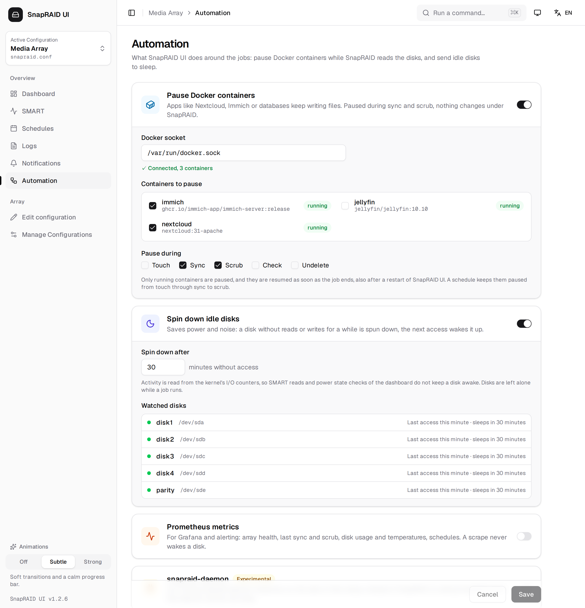
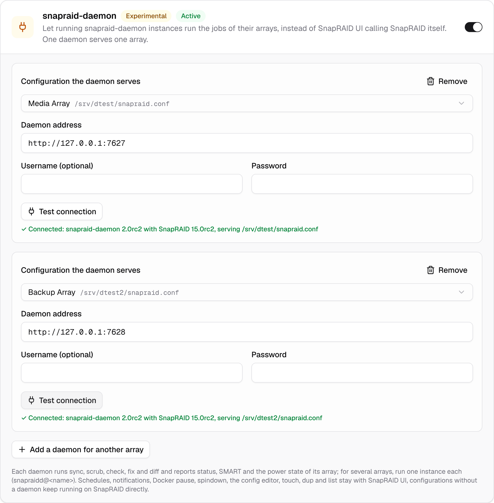

# Automation

What SnapRAID UI can do around the jobs, all off by default: pause Docker containers while SnapRAID reads the disks, spin disks down once they have been idle for a while, and hand the jobs of an array to [snapraid-daemon](#snapraid-daemon-experimental). Set them up under **Automation** in the sidebar.



Changes take effect when you click *Save*. The settings are stored in `maintenance.json` in the data folder and are part of the [settings backup](disks.md#backup-and-restore).

## Pause Docker containers

Apps like Nextcloud, Immich, photo libraries or databases keep writing files on the data disks. A file that changes while `sync` reads it gets parity that does not match, and `scrub` reports it as an error. Pausing those containers for the duration of the job keeps their files still.

| Field | Default | Description |
|---|---|---|
| *Docker socket* | `/var/run/docker.sock` | The Docker API socket, [mounted into the container](installation.md#docker-socket-optional). The line below it shows whether it can be reached and how many containers it reports. |
| *Containers to pause* | none | The containers on that socket. SnapRAID UI's own container is listed but can't be picked: paused, it could not resume the others. A container picked earlier that no longer exists is shown as *not found*. |
| *Pause during* | *Sync*, *Scrub* | The jobs to pause them for: *Touch*, *Sync*, *Scrub*, *Check*, *Undelete*. |

How it works:

- Before the job starts, every picked container that is *running* is paused (`docker pause`). Containers that are stopped or already paused are left alone, and are not resumed afterwards.
- When the job ends, successful or not, the containers paused for it are resumed in reverse order.
- A schedule with the [nightly routine](scheduling.md#the-nightly-sync-routine) keeps them paused from `touch` through `sync` to `scrub`, instead of resuming them between the steps.
- The job output shows which containers were paused and resumed, and any container that could not be paused. A container that fails to pause does not stop the job.
- If SnapRAID UI is restarted while containers are paused, it resumes them on the next start.

`docker pause` freezes the processes, it does not stop them. Connections stay open and the apps continue where they were. Clients of a paused app wait for the job; schedule long syncs and scrubs for the night.

> [!WARNING]
> Access to the Docker socket is access to the host: whoever can use it can start privileged containers. Only mount it if you need this feature, and protect the UI with a [login](security.md).

## Spin down idle disks

A disk without reads or writes for the set time is spun down with `snapraid down`, which uses `smartctl -s standby,now`. The next access wakes it up again.

| Field | Default | Description |
|---|---|---|
| *Spin down after* | 30 | Minutes without access, 5 to 1440. |

How it works:

- Once a minute SnapRAID UI reads the kernel's I/O counters (`/proc/diskstats`) for every disk of the enabled configurations; which device belongs to which disk comes from `snapraid devices`.
- It watches the counters of the disk's partition. SMART reads and the power state checks of the dashboard only count as I/O of the whole disk, so they do not keep a disk awake.
- A disk that has been spun down is not sent to sleep again until it was active in between.
- While a job runs, and in the two minutes before a schedule starts, nothing is spun down: `snapraid down` holds SnapRAID's lock for a moment, a job starting meanwhile would fail.

*Watched disks* lists the disks with their device, their last access and when they will be spun down, or *Spun down …* for sleeping ones. If no disks show up, SnapRAID can't see the devices; in Docker the container has to be [privileged](installation.md#privileged-mode-and-smart).

> [!NOTE]
> If the host already spins disks down, for example with `hdparm -S` or `hd-idle`, leave this off or use the same idle time. Frequent spin-ups wear disks more than running; very short idle times are not worth it for disks that are used every few minutes.

## Home Assistant

Each array of SnapRAID UI appears in [Home Assistant](https://www.home-assistant.io) as a device, through [MQTT discovery](https://www.home-assistant.io/integrations/mqtt/#mqtt-discovery). No custom integration to install: Home Assistant's MQTT integration picks the entities up on its own.

| Field | Default | Description |
|---|---|---|
| *MQTT broker* | | The broker Home Assistant uses, e.g. `mqtt://homeassistant.local:1883` for the Mosquitto add-on, or `mqtts://` for TLS. |
| *Username*, *Password* | | Credentials on the broker; for the Mosquitto add-on a Home Assistant user. The password is stored in `home-assistant.json` (mode 600) and never sent back to the browser. |
| *Discovery prefix* | `homeassistant` | Change it only if you changed it in Home Assistant. |
| *Topic of SnapRAID UI* | `snapraid-ui` | Where the state is published and the buttons are received. |

*Test connection* connects with the values as entered. After saving, the card shows *Connected* or *Not connected*.

Entities of a device *SnapRAID &lt;name&gt;*:

| Entity | Type | Value |
|---|---|---|
| Health | sensor | `ok`, `errors` (bad blocks), `disk_missing`, `sync_incomplete`, or `unknown` until the status was read once |
| Problem | binary sensor (problem) | On when the health is not `ok` |
| Job running | binary sensor (running) | On while a job of this array runs |
| Bad blocks | sensor | Blocks marked bad by scrub or check |
| Last sync, Last scrub | sensor (timestamp) | End of the last run |
| Scrubbed | sensor (%) | Share of the array scrubbed |
| *disk* temperature, *disk* used | sensor (°C, %) | Per disk, from the last SMART read and status read |
| Sync, Scrub | button | Starts the job, scrub with the default plan |

The *Sync* button runs with the sync guard of a new schedule: it is skipped when `diff` reports more than 50 deleted or 100 changed files, and the *A scheduled job was skipped* notification says why. Nothing starts while another job runs.

The values come from what SnapRAID UI already knows, as for the [Prometheus metrics](#prometheus-metrics), so publishing never wakes a disk. State is published when it changes (checked every 5 seconds for jobs, every 30 seconds otherwise) and at least every 5 minutes, all as retained messages. `snapraid-ui/status` is `online` while SnapRAID UI is connected and `offline` otherwise (MQTT last will), so the entities turn unavailable when SnapRAID UI is down. When Home Assistant restarts, it gets the discovery again; entities of a removed array are removed.

Example automation, a push to the phone when the array has a problem:

```yaml
automation:
  - alias: SnapRAID problem
    trigger:
      - platform: state
        entity_id: binary_sensor.snapraid_media_problem
        to: "on"
    action:
      - service: notify.mobile_app_phone
        data:
          message: "SnapRAID: {{ states('sensor.snapraid_media_health') }}"
```

## Prometheus metrics

Exposes the state of the arrays for [Prometheus](https://prometheus.io) at `/api/metrics`, for Grafana dashboards and alerts. The values come from what SnapRAID UI already knows; a scrape runs neither SnapRAID nor `smartctl`, so it never wakes a disk.

| Field | Default | Description |
|---|---|---|
| *Access token* | generated | Prometheus sends it as bearer token (`Authorization: Bearer <token>`). *New token* replaces it. Leave it empty only on a network you trust. |

The page shows a ready `scrape_configs` entry for `prometheus.yml`. The login of the UI does not apply to `/api/metrics`, the token does; without it the endpoint answers 401, and 404 while the metrics are switched off.

| Metric | Labels | Value |
|---|---|---|
| `snapraid_ui_up` | | Always 1 |
| `snapraid_job_running`, `snapraid_job_info` | `command`, `config` | 1 while a job runs, and which |
| `snapraid_last_sync_timestamp_seconds`, `snapraid_last_scrub_timestamp_seconds` | `config` | End of the last sync or scrub, from the logs |
| `snapraid_last_sync_success`, `snapraid_last_scrub_success` | `config` | 1 when it succeeded (also with warnings) |
| `snapraid_bad_blocks` | `config` | Blocks marked bad, repaired by *Repair and verify* |
| `snapraid_sync_incomplete` | `config` | 1 when the last sync did not finish |
| `snapraid_scrubbed_ratio`, `snapraid_oldest_scrub_days` | `config` | Share of the array scrubbed, age of the oldest scrub |
| `snapraid_disks_unavailable` | `config` | Disks missing or empty, probably not mounted |
| `snapraid_status_timestamp_seconds` | `config` | When the values above were read |
| `snapraid_disk_used_bytes`, `snapraid_disk_free_bytes` | `config`, `disk` | Space at the last status read |
| `snapraid_disk_temperature_celsius`, `snapraid_disk_reallocated_sectors`, `snapraid_disk_pending_sectors`, `snapraid_disk_crc_errors` | `config`, `disk` | From the last SMART read |
| `snapraid_schedule_enabled`, `snapraid_schedule_next_run_timestamp_seconds`, `snapraid_schedule_last_run_timestamp_seconds` | `schedule`, `command` | Per schedule |
| `snapraid_schedule_last_success`, `snapraid_schedule_last_skipped` | `schedule`, `command` | Result of its last run |

The status values (bad blocks to `snapraid_disks_unavailable`) come from the last time the dashboard or a schedule read the status; after a restart of SnapRAID UI they return with the next read. Values SMART did not report are left out rather than reported as 0.

Example alert rules:

```yaml
- alert: SnapraidSyncOverdue
  expr: time() - snapraid_last_sync_timestamp_seconds > 2 * 86400
- alert: SnapraidBadBlocks
  expr: snapraid_bad_blocks > 0
- alert: SnapraidDiskHot
  expr: snapraid_disk_temperature_celsius >= 50
```

## snapraid-daemon (experimental)

[snapraid-daemon](https://github.com/amadvance/snapraid-daemon) is the SnapRAID author's own background service with a REST API. If you run it already, SnapRAID UI can hand the jobs of an array to it instead of calling SnapRAID itself. Turn it on with *snapraid-daemon* on the Automation page.



A daemon serves exactly one array. For several arrays run one instance per array, as the daemon intends it: with systemd through its template unit, e.g. `systemctl enable --now snapraidd@media snapraidd@backup`, each with its own `snapraidd-<name>.conf`, `snapraid-<name>.conf` and port (`net_port`). In SnapRAID UI add one entry per daemon:

| Field | Description |
|---|---|
| *Configuration the daemon serves* | The SnapRAID UI configuration of the array; each configuration can have one daemon. |
| *Daemon address* | e.g. `http://127.0.0.1:7627`, the `net_port` of that instance. |
| *Username*, *Password* | Only if the daemon has `net_auth_credential` set. The password is stored in `engine.json` (file mode `600`) and never sent back to the browser. |

*Test connection* shows the daemon and SnapRAID version and the `snapraid.conf` the daemon serves, and warns when the daemon would do something on its own that SnapRAID UI also does.

### Set up the daemon for it

SnapRAID UI keeps the schedules, the notifications, the Docker pause and the spindown. Turn them off in the daemon, or both would run:

```ini
# snapraidd-<name>.conf
maintenance_schedule =
spindown_idle_minutes = 0
hook_docker_pause =
notify_result =
notify_start =
```

### What runs where

| | On the daemon | In SnapRAID UI |
|---|---|---|
| sync, scrub, check, fix, diff, SMART, power state, status of the array | ✓ | |
| touch (the daemon has no touch job), dup, list, the config editor and the disk wizards | | ✓, through the SnapRAID CLI |
| Schedules, notifications, Docker pause, spindown | | ✓ |
| Configurations without a daemon | | ✓, through the SnapRAID CLI |

As before, one job runs at a time across all arrays.

### Limitations

- snapraid-daemon 2.0 and SnapRAID 15 are release candidates. The daemon mode was tested with snapraid-daemon 2.0rc2 and SnapRAID 15.0rc2.
- The daemon does not count files per disk, the *Files* column of the disks table shows "–".
- *Last sync* and *Last scrub* come from the daemon's task history. Its logs are the daemon's, so there is no *Log* link and its runs don't show on the Logs page.
- The daemon reports SMART attributes by name. SnapRAID UI maps the common ones (reallocated, pending and uncorrectable sectors, CRC errors, …) to their ids for its assessment; other attributes are shown without an id.
- touch, dup and list call SnapRAID directly, so SnapRAID UI needs the disks mounted, and should have the same SnapRAID version as the daemon. touch runs as a job, one at a time as usual. Jobs the daemon starts by itself, e.g. from its own web UI, are not seen by SnapRAID UI.
